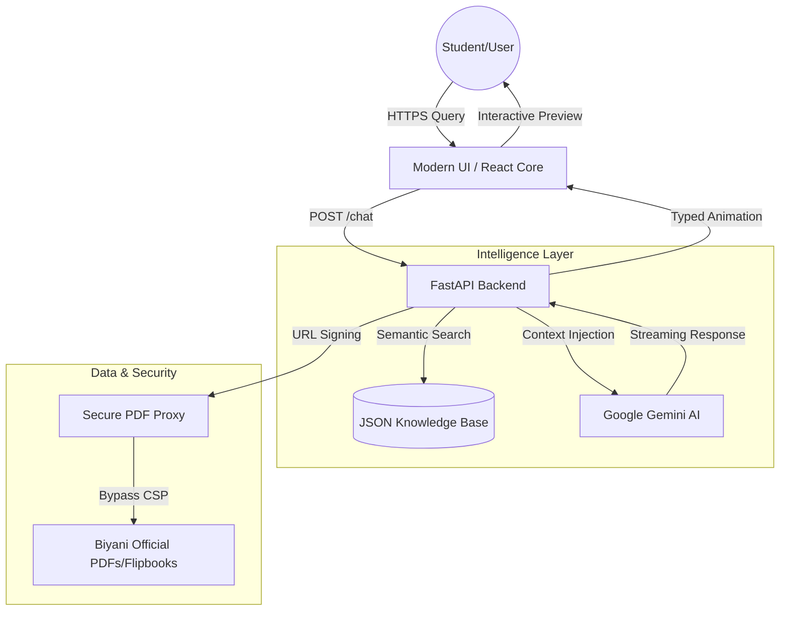

# Biyani AI Counselor | Intelligent Institutional Assistant

[](https://your-deployment-link.com)
[](https://vitejs.dev/)
[](https://opensource.org/licenses/MIT)

> "Bridging the gap between institutional knowledge and student aspirations through advanced RAG engineering."

[LinkedIn](https://www.linkedin.com/in/kushal-kumawat/) • [Source Code](https://github.com/Kushal96499/college-chatbot) • [Institutional Website](https://www.biyanicolleges.org)

---

## The Engineering Philosophy

In the era of information overload, the **Biyani AI Counselor** serves as a precision-first guidance hub. Developed during the 3rd year of BCA at Biyani Group of Colleges, this system replaces static FAQ pages with a high-craft, resilient AI environment. By leveraging Retrieval-Augmented Generation (RAG) and a custom secure PDF proxy, it ensures that official institutional data is accessible, verified, and engaging.

---

## Technical Architecture & Workflow

The system utilizes a distributed RAG architecture designed for low latency and high accuracy across academic queries.



---

## System Walkthrough

### 1. Unified Admission Dashboard
<!-- [SCREENSHOT_PLACEHOLDER: Main Chat Interface] -->
*A premium, minimalist interface with quick-action triggers for Admission, Placement, and Scholarships.*

### 2. Intelligent Document Proxy
<!-- [SCREENSHOT_PLACEHOLDER: PDF Preview Implementation] -->
*Real-time rendering of official institutional brochures bypassing restrictive Content Security Policies (CSP).*

---

## Core Features

- **Resilient Multi-Model Architecture**: A hybrid AI system utilizing **Google Gemini (Pro/Flash)** as primary intelligence, with **Groq (Llama 3)** and **OpenRouter** as high-speed fallback layers to ensure 100% uptime and quota resilience.
- **Advanced RAG Engine**: Utilizes semantic search to synthesize natural responses based strictly on 120+ verified institutional documents.
- **Secure PDF Proxy**: A custom backend layer that streams raw bytes from institutional servers to bypass framing restrictions (CSP).
- **Real-time Typing Engine**: A synchronized character-by-character animation that enhances human-like interaction.
- **Smart Document Detection**: Automatically triggers official document previews (Prospectus, Annual Reports) based on query intent.
- **Responsive Mobile-First Design**: Optimized for seamless performance across all mobile and tablet viewports.

---

## Why Multi-Model?

To ensure professional-grade reliability, the counselor rotates between different AI providers:
1. **Gemini**: Primary model for complex institutional reasoning.
2. **Groq**: Leveraged for sub-second response times during high traffic.
3. **OpenRouter**: Acts as a universal bridge to ensure the service remains live even if primary API quotas are exhausted.

---

---

## Tech Stack

- **Frontend**: HTML5, Vanilla CSS3, React.js.
- **Backend**: Python 3.10+, FastAPI, Uvicorn.
- **AI/ML**: Google Gemini AI API, LangChain.
- **Database**: High-performance JSON-based Semantic Store.
- **Processing**: PyPDF2 & OCR for data extraction.

---

## Installation & Setup

1. **Clone the Repository**:
   ```bash
   git clone https://github.com/Kushal96499/Biyani-AI-Counselor
   cd Biyani-AI-Counselor
   ```

2. **Environment Configuration**:
   Create a `.env` file:
   ```env
   GOOGLE_API_KEY=your_gemini_api_key_here
   ```

3. **Backend Setup**:
   ```bash
   pip install -r requirements.txt
   python -m uvicorn app.main:app --reload
   ```

4. **Frontend Setup**:
   Open `frontend/index.html` via Live Server.

---

## License

Distributed under the MIT License. See `LICENSE` for more information.

---

<p align="center">
  Developed by <b>Kushal Kumawat</b> <br/>
  <i>Biyani Group of Colleges • Excellence Since 2005</i>
</p>
