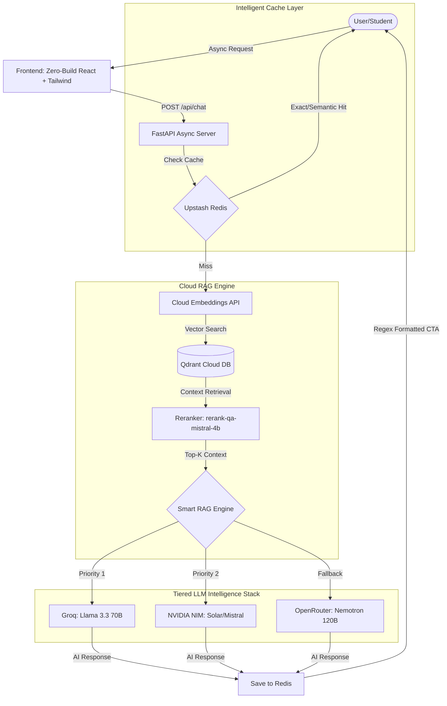

# 🎓 Biyani AI Counselor - Ultra-Premium RAG Architecture


A state-of-the-art, high-intelligence **Retrieval-Augmented Generation (RAG)** chatbot engineered specifically for the **Biyani Group of Colleges**. 

This system is built with a **100% Serverless Architecture**, designed to bypass traditional deployment constraints by utilizing cloud-based embedding APIs, a high-speed Redis caching layer, and a non-blocking asynchronous backend.

---

## 🏗️ Technical Architecture

The pipeline is completely cloud-native and asynchronous. Every request is handled concurrently to support multiple users simultaneously.



---

## 🌟 Premium Features

### 1. High-Speed Redis Caching (Exact + Semantic)
- **Sub-10ms Responses**: Uses Upstash Redis (REST) for instant exact-match query retrieval.
- **Semantic Reusability**: Uses vector similarity (0.88 threshold) to reuse answers for similar phrasing, saving API costs and improving speed.
- **Dynamic TTL**: Critical data (fees/admissions) expires faster than static info (about college).

### 2. Async Multi-User Concurrency
- **Non-blocking Backend**: Built on **FastAPI Async**, allowing the server to handle hundreds of requests without sequential blocking.
- **Queue Tracking**: Real-time tracking of active requests to inform users of the system status during peak traffic.

### 3. Ultra-Premium UI/UX
- **Standalone React Architecture**: Runs directly in `index.html` via CDN for zero-build deployment.
- **Glassmorphism Design**: Apple-like `backdrop-blur-3xl` and multi-layered glowing background blobs.
- **Frame-Independent Typing**: Uses `requestAnimationFrame` to ensure typing effects never pause when the tab is in the background.

### 4. Vercel-Optimized Performance
- **Lightweight Payload**: Completely removed heavy local ML models (fastembed/pypdf) to fit Vercel's 250MB limit.
- **Tiered Cloud Failover**: 100% crash-proof logic. If one provider rate-limits, it instantly fails over to the next in <200ms.

---

## 🛠️ Technology Stack

### Backend & AI
- **Framework**: FastAPI (Asynchronous Python 3.12)
- **Vector Database**: Qdrant Cloud
- **Cache**: Upstash Redis (REST API)
- **Reranker Engine**: Mistral QA Reranker (`rerank-qa-mistral-4b`)
- **LLM Engine**:
  - **GROQ**: Llama 3.3 70B / 3.1 8B *(Primary)*
  - **NVIDIA NIM**: Upstage Solar / Llama 3.1 70B *(Secondary)*
  - **OPENROUTER**: Nemotron / Gemma *(Fallback)*

### Frontend
- **Framework**: React 18 (CDN Standalone)
- **Styling**: Tailwind CSS 3.0 (CDN)
- **Typography**: Google Fonts (Outfit / Inter)

---

## 📦 Local Installation

1. **Clone the repository**:
   ```bash
   git clone https://github.com/Kushal96499/Biyani-AI-Counselor.git
   cd Biyani-AI-Counselor
   ```

2. **Environment Variables**:
   Create a `.env` file in the root directory and add your keys:
   ```env
   # Vector DB & Cache
   QDRANT_URL=your_qdrant_url
   QDRANT_API_KEY=your_key
   UPSTASH_REDIS_REST_URL=your_url
   UPSTASH_REDIS_REST_TOKEN=your_token

   # LLM Providers
   GROQ_API_KEY=your_key
   NVIDIA_API_KEY=your_key
   OPENROUTER_API_KEY=your_key
   ```

3. **Install & Run**:
   ```bash
   pip install -r requirements.txt
   uvicorn app.main:app --reload
   ```

---

## 👨‍💻 Internship & Development
This project was developed as part of an official **College Internship** at the **Biyani Web Cell**.

- **Developer**: **Kushal Kumawat** (BCA 3rd Year Student)
- **Institution**: Biyani Institute of Science & Management, Jaipur
- **Internship Mentor**: Developed under the esteemed guidance of **Pankaj Sir** (Web Cell Head).
- **Project Scope**: Research and implementation of AI-driven counseling automation for the Biyani Group of Colleges.

---
*Built with ❤️ by **Kushal Kumawat** to empower students at the Biyani Group of Colleges.*
