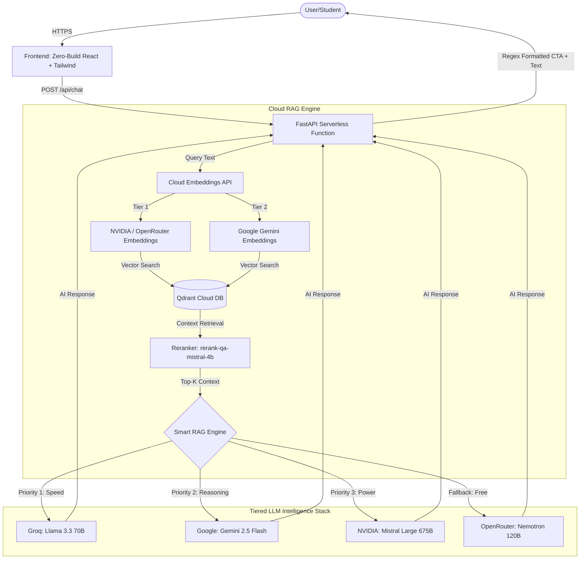

# 🎓 Biyani AI Counselor - Ultra-Premium RAG Architecture


A state-of-the-art, high-intelligence **Retrieval-Augmented Generation (RAG)** chatbot engineered specifically for the **Biyani Group of Colleges**. 

This system is built with a **100% Serverless Architecture**, designed to bypass traditional deployment constraints (like Vercel's 250MB size limits and read-only filesystems) by utilizing cloud-based embedding APIs, a distributed tiered LLM engine, and a zero-build CDN-powered frontend.

---

## 🏗️ Technical Architecture

The pipeline is completely cloud-native. Local heavy dependencies (like `fastembed` and `pypdf`) have been purged in favor of high-speed API inferences, allowing the backend to cold-start in milliseconds.



---

## 🌟 Premium Features

### 1. Ultra-Premium UI/UX (Zero-Build Frontend)
- **Standalone React Architecture**: No `npm run build` or `webpack` required. Uses Babel-standalone and React via CDN to run directly in `index.html`.
- **Glassmorphism Design**: Features Apple-like `backdrop-blur-3xl`, multi-layered glowing background blobs, and dynamic CSS animations.
- **Smart UX**: Features intelligent auto-scrolling (which pauses if the user scrolls up to read history), animated radar pings, and a floating emoji welcome modal.
- **Regex-Powered CTA Engine**: The backend LLM is instructed to wrap Call-To-Action messages in `[CTA]...[/CTA]` tags. The frontend regex engine instantly converts these into beautiful, clickable red UI buttons dynamically.

### 2. Vercel-Optimized Backend
- **Lightweight Payload**: Bypasses Vercel's 250MB deployment limit by removing massive local ML models.
- **Tiered Cloud Embeddings**: Completely removes `fastembed` and local ONNX files. Uses NVIDIA Embeddings via OpenRouter as Priority 1, and Google Gemini Embeddings as Priority 2.
- **Advanced Reranking**: Utilizes `rerank-qa-mistral-4b` to precisely re-sort the retrieved documents from Qdrant, ensuring only the most highly relevant context reaches the LLM.
- **Graceful Error Handling**: 100% crash-proof fallback mechanisms. If a provider rate-limits the app, it instantly fails over to the next provider in less than 200ms.

### 3. Anti-Hallucination "Smart Bridging"
- **Strict Grounding**: The system prompt is engineered to *never* invent university statistics or mention fake institutions.
- **Smart Bridging**: If the context doesn't contain a specific answer (like an exact syllabus fee), the AI does not say "I don't know". Instead, it bridges the conversation: *"For the exact fees, please connect with our Admission Cell."*
- **Bilingual Intelligence**: Automatically detects whether the user is typing in Hindi, Hinglish, or English, and adapts its personality to act as a warm, persuasive Academic Counselor.

---

## 🛠️ Technology Stack

### Frontend
- **Framework**: React 18 (CDN Standalone)
- **Styling**: Tailwind CSS (CDN)
- **Typography**: Google Fonts (Outfit)

### Backend
- **Framework**: FastAPI (Python 3.10+)
- **Vector Database**: Qdrant Cloud
- **Reranker Engine**: Mistral QA Reranker (`rerank-qa-mistral-4b`)
- **Embedding Engine**:
  - **Tier 1**: NVIDIA (`llama-nemotron-embed-vl-1b-v2` via OpenRouter)
  - **Tier 2**: Google Gemini (`gemini-embedding-2`)
  - **Tier 3**: HuggingFace Inference API (Fallback)
- **LLM Engine**:
  - **GROQ**: Llama 3.3 70B / 8B *(Primary)*
  - **GEMINI**: 2.5 Flash / Flash Lite *(Secondary)*
  - **NVIDIA**: Mistral Large 3 / Dracarys 70B *(Tertiary)*
  - **OPENROUTER**: Nemotron / Gemma *(Fallback)*

---

## 📦 Local Installation

1. **Clone the repository**:
   ```bash
   git clone https://github.com/Kushal96499/Biyani-AI-Counselor.git
   cd Biyani-AI-Counselor
   ```

2. **Set up Virtual Environment**:
   ```bash
   python -m venv venv
   .\venv\Scripts\activate
   ```

3. **Install Dependencies**:
   ```bash
   pip install -r requirements.txt
   ```

4. **Environment Variables**:
   Create a `.env` file in the root directory and add your keys:
   ```env
   # Vector DB
   QDRANT_URL=your_qdrant_url
   QDRANT_API_KEY=your_key
   QDRANT_COLLECTION=biyani_ai_clean_v2

   # LLM Providers (Add at least 2 for redundancy)
   GROQ_API_KEY=your_key
   GEMINI_API_KEY=your_key
   NVIDIA_API_KEY=your_key
   OPENROUTER_API_KEY=your_key
   ```

5. **Run the Development Server**:
   ```bash
   uvicorn app.main:app --reload
   ```
   Open `http://localhost:8000` in your browser to interact with the AI.

---
*Built with ❤️ to empower students and automate counseling at the Biyani Group of Colleges.*
