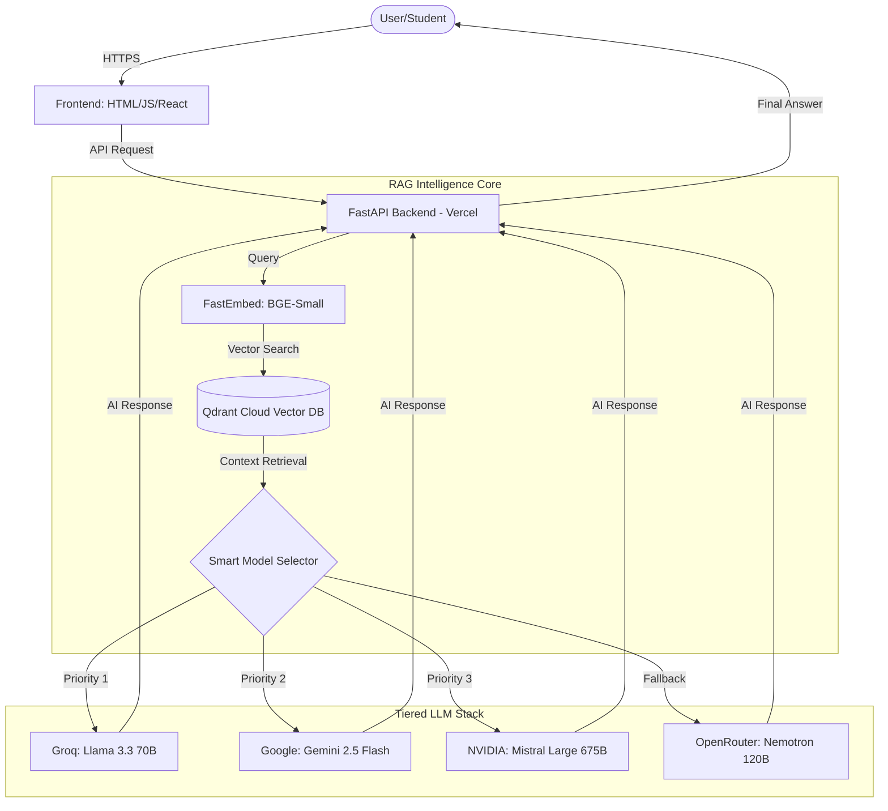

# 🎓 Biyani AI Counselor - Premium RAG Chatbot

A high-intelligence, multi-provider RAG (Retrieval-Augmented Generation) chatbot designed for the Biyani Group of Colleges. This system utilizes a distributed architecture designed for low latency and high availability.

## 🏗️ Technical Architecture & Workflow

The system follows a modern RAG pipeline with a tiered LLM stack to ensure 100% uptime and high reasoning capabilities.



## 🚀 Key Features

- **Gold 6 Model Stack**: Intelligent switching between 4 providers (Groq, Gemini, NVIDIA, OpenRouter).
- **Vercel Optimized**: Lightweight `FastEmbed` implementation for < 500MB bundle size.
- **Smart RAG Engine**: Semantic search using Qdrant Vector Database.
- **Natural Personality**: Professional yet warm Academic Counselor persona.
- **Language Intelligence**: Seamlessly detects and responds in English or natural Hinglish.

## 🛠️ Tech Stack

- **Backend**: FastAPI (Python 3.10+)
- **Vector DB**: Qdrant Cloud
- **Embeddings**: BAAI/bge-small-en-v1.5 via `fastembed`
- **LLM Providers**:
  - **GROQ**: Llama 3.3 70B & 3.1 8B (Speed)
  - **GEMINI**: 2.5 Flash & Flash Lite (Reasoning)
  - **NVIDIA**: Mistral Large 3 (675B) & Dracarys 70B (Power)
  - **OPENROUTER**: Nemotron 120B (Stability)

## 📦 Installation

1. **Clone the repository**:
   ```bash
   git clone https://github.com/Kushal96499/Biyani-AI-Counselor.git
   cd Biyani-AI-Counselor
   ```

2. **Set up Virtual Environment**:
   ```bash
   python -m venv venv
   .\venv\Scripts\activate
   ```

3. **Install Dependencies**:
   ```bash
   pip install -r requirements.txt
   ```

4. **Environment Variables**:
   Create a `.env` file and add your keys:
   ```env
   QDRANT_URL=your_qdrant_url
   QDRANT_API_KEY=your_key
   GROQ_API_KEY=your_key
   GEMINI_API_KEY=your_key
   NVIDIA_API_KEY=your_key
   OPENROUTER_API_KEY=your_key
   ```

## 🌐 Deployment (Vercel)

This project is configured for Vercel Serverless Functions.

1. Install Vercel CLI: `npm i -g vercel`
2. Run `vercel login` and `vercel` to deploy.
3. Add Environment Variables in the Vercel Dashboard.

---
Built with ❤️ for Biyani Group of Colleges.
