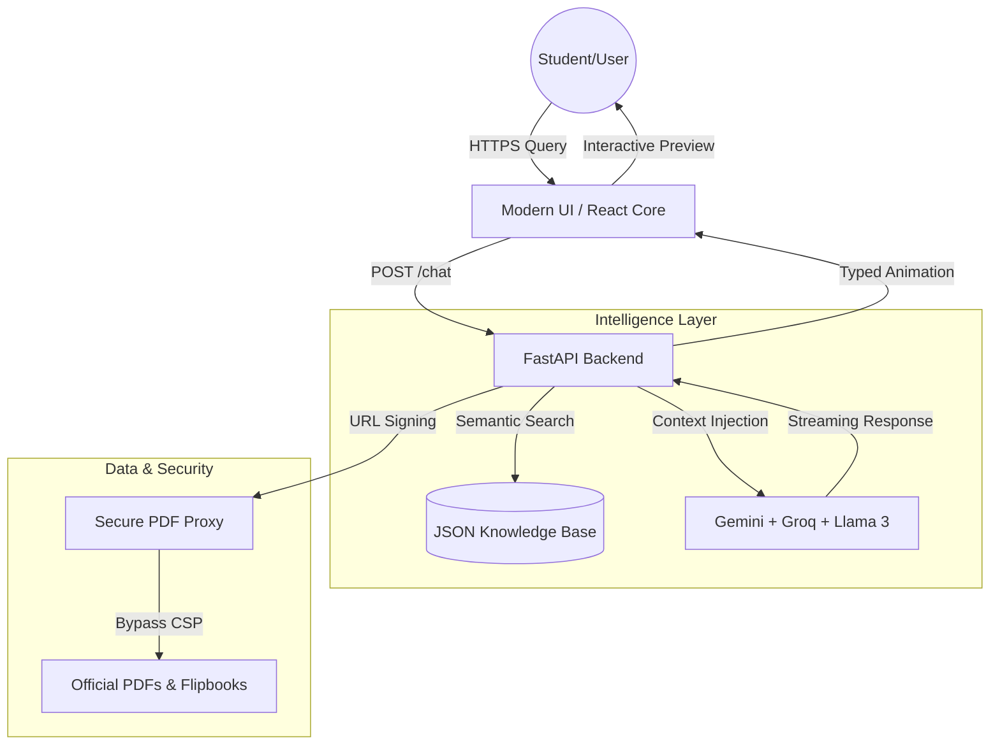

# Biyani AI Counselor | Intelligent Institutional Assistant

[](https://your-deployment-link.com)
[](https://vitejs.dev/)
[](https://opensource.org/licenses/MIT)

> "Bridging the gap between institutional knowledge and student aspirations through a resilient, multi-model RAG ecosystem."

[LinkedIn](https://www.linkedin.com/in/kushal-ku/) • [Source Code](https://github.com/Kushal96499/Biyani-AI-Counselor) • [Institutional Website](https://www.biyanicolleges.org)

---

## The Engineering Philosophy

In the era of information overload, the **Biyani AI Counselor** serves as a precision-first guidance hub. Developed during the 3rd year of BCA at Biyani Group of Colleges, this system replaces static FAQ pages with a high-craft, resilient AI environment. By leveraging **Retrieval-Augmented Generation (RAG)** and a custom **Secure PDF Proxy**, it ensures that official institutional data is accessible, verified, and engaging.

---

## 🚀 Intelligent Multi-Model Strategy

To ensure 100% uptime and sub-second response times, the counselor utilizes a sophisticated multi-model rotation strategy:

1.  **Google Gemini 1.5 Pro/Flash**: The primary "Academic Brain." It handles complex institutional reasoning and executes high-precision OCR on scanned PDFs.
2.  **Groq (Llama 3 70B/8B)**: Integrated for ultra-low latency. Groq provides lightning-fast responses (sub-500ms) during peak traffic or as a high-speed fallback.
3.  **OpenRouter**: Serves as a universal gateway to ensure the service remains live even if primary API quotas from Google or Groq are exhausted.

---

## 🏗️ Technical Architecture

The system utilizes a distributed RAG architecture designed for institutional reliability.



---

## ⚡ Core Features

- **Resilient RAG Engine**: A hybrid semantic search system that synthesizes responses based on 120+ verified institutional documents.
- **Secure PDF Proxy**: A custom backend layer that streams raw bytes to bypass restrictive Content Security Policies (CSP) and 'frame-ancestors' blocks.
- **Vision-Powered OCR**: Automatically extracts text from legacy or scanned PDF documents using Gemini's multi-modal capabilities.
- **Interactive UI/UX**: Includes character-by-character typing animation (10ms speed) and glassmorphism design elements.
- **Smart Document Triggering**: Intelligently displays official Brochures or Placement Reports only when relevant to the user's query.

---

## 🛠️ Detailed Tech Stack

### Backend & AI
- **Framework**: FastAPI (Python 3.10+)
- **LLM APIs**: Google Gemini API, Groq Cloud, OpenRouter.
- **Vector Engine**: Custom JSON-based Semantic Store (Lite-RAG).
- **Processing**: LangChain, PyPDF2, OCR (Vision AI).

### Frontend
- **Core**: Modern React Hooks architecture.
- **Styling**: Vanilla CSS3 with Custom Design System tokens.
- **Animations**: CSS Transitions + Framer-inspired sequencing.

### Infrastructure
- **Security**: CORS/CSP Proxy, Environment-based Secret Management.
- **Documentation**: Professional MIT Licensing, Technical README.

---

## 📜 Installation

1. **Clone & Install**:
   ```bash
   git clone https://github.com/Kushal96499/Biyani-AI-Counselor.git
   pip install -r requirements.txt
   ```

2. **Environment Setup**:
   Rename `.env.example` to `.env` and add your API keys:
   ```env
   GEMINI_API_KEY=your_key
   GROQ_API_KEY=your_key
   OPENROUTER_API_KEY=your_key
   ```

3. **Run Locally**:
   ```bash
   python -m uvicorn app.main:app --reload
   ```

---

<p align="center">
  Developed with ❤️ by <b>Kushal Kumawat</b> <br/>
  <i>Biyani Group of Colleges • Excellence Since 2005</i>
</p>
